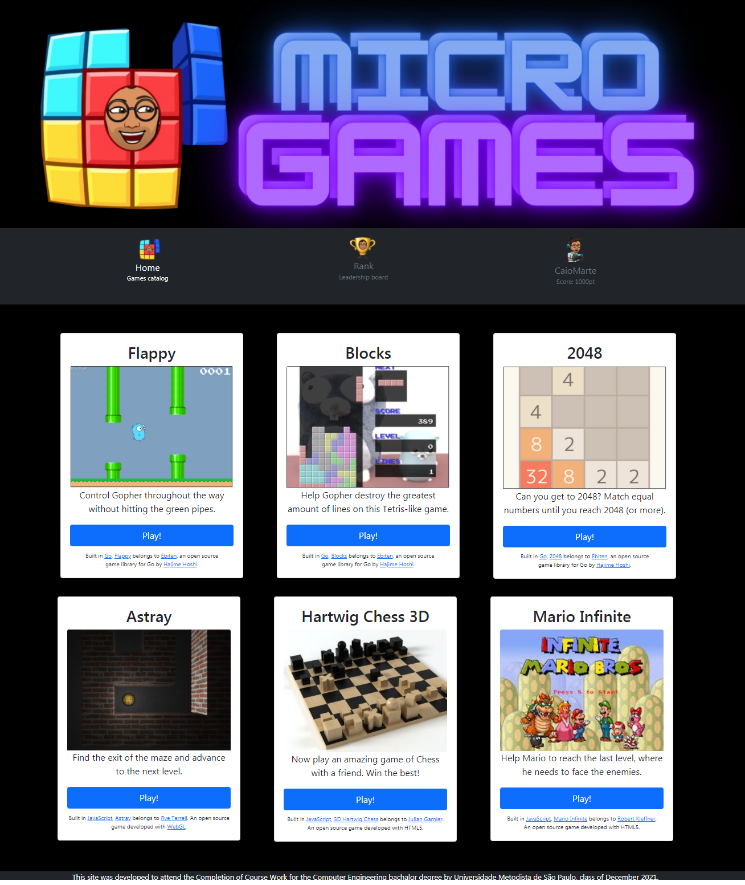

# Trabalho de Conclusão de Curso (TCC)
Será apresentado na [Universidade Metodista de São Paulo](https://metodista.br) em 2021 para conclusão do curso de **Engenharia de Computação**.

# Análise comparativa dos serviços de orquestração de containers da Amazon Web Services (AWS)

Projeto que proporcionará o entendimento das vantagens e desvantagens dos orquestradores Amazon Elastic Container Service (Amazon ECS) e Amazon Elastic Kubernetes Service (Amazon EKS) sob a ótica da confiabilidade, performance e custo.

## Página inicial do sistema

## Tecnologias utilizadas

* Go
* HTML, CSS e JS

# Instruções para execução do projeto

1. Efetue o download/clonamento do projeto para sua máquina. Executando o seguinte comando abaixo:
`git clone https://github.com/caiomarte/tcc.git`

2. Uma vez baixado o projeto em sua máquina, possa inicia-lo localmente. Executando os comandos abaixo: 
`go mod init github.com/caiomarte/tcc`
` go run . `