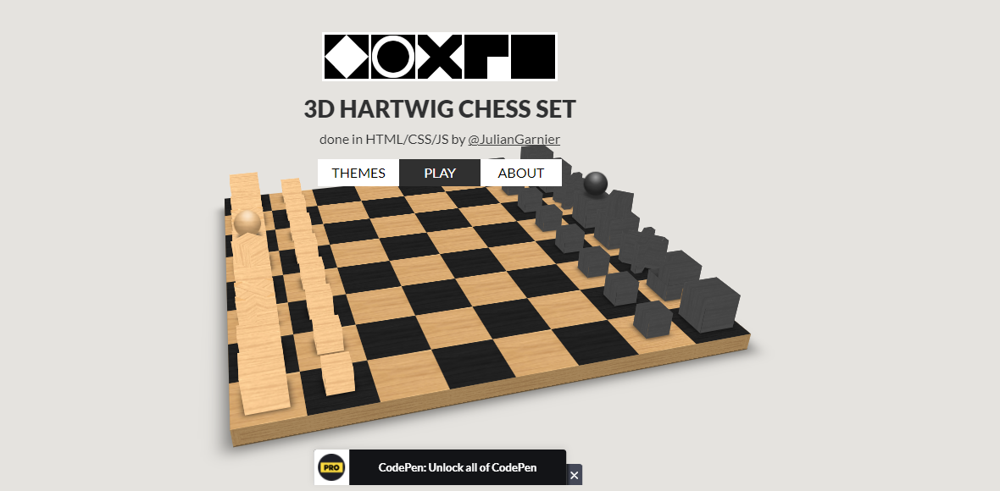

# Hartwig Chess 3D

Open Source Game desenvolvido pelo autor Julian Garnier, utilizando apenas HTML, CSS e JS com as seguintes bibliotecas: [Photon](http://photon.attasi.com) e [Chess.js](https://github.com/jhlywa/chess.js).

A versão oficial do Game está disponível em: https://codepen.io/juliangarnier/full/BsIih

## Página inicial do game


## Executando o jogo no projeto

1. Acesse o seguinte caminho dentro da pasta do projeto: `\sample-app\services\sample-app\services\3D-Hartwig-chess-set`. Execute os seguintes comandos abaixo:

```
go mod init github.com/caiomarte/tcc
```

```
go run main.go
```

2. Ele subirá um servidor no endereço `http://localhost:8085`. Acesse diretamente em seu browser.

## Creditos 
Julian Garnier

